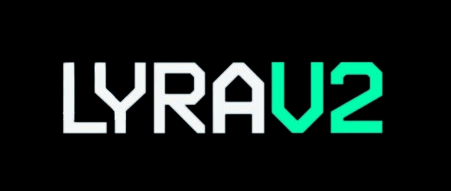

## Lyra V2 Account Abstraction

<div align="center">
  <p align='center'>
    <br>
    
    <h5 align="center"> Account Abstraction is here! </h6>
</p> 
</div>

This repo contains all contracts that help Lyra v2 achieve Account Abstraction experience. 
More specifically, for L1 to L2 gasless deposits, we use Gelato relayer; for all L2 transactions, we adopt ERC4337, with our own Paymaster and [LightAccount](!https://github.com/alchemyplatform/light-account/blob/main/src/LightAccount.sol) from Alchemy. 

## Usage

### Build

```shell
$ forge build
```

### Test

```shell
$ forge test
```

### Using the contracts

Go see [this repo](https://github.com/antoncoding/lyra-aa-example) for examples